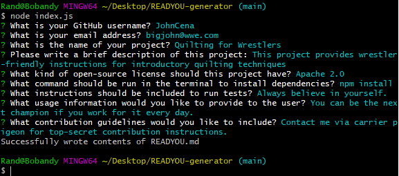

# Weather Dashboard

## Description


## Table of Contents
* [Technologies Used](#technologies-used)
* [How to Access](#how-to-access)
* [What I Did](#what-i-did)
* [Code Snippets](#code-snippets)
* [Screenshots](#screenshots)
* [Acknowledgments](#acknowledgments*)
* [Who I Am](#who-i-am)

---

## Technologies Used
* [Javascript](https://www.javascript.com/) to develop the algorithms included in this web application.
* [Node.js](https://nodejs.org/en/docs/) to run this Javascript program in the terminal/Git Bash console.
* [Git](https://git-scm.com/) for distributed version control, tracking changes over time and making them visible to collaborators.
* [Github](https://github.com/) for version control in the cloud, saving my changes and presenting them clearly to myself and others.

## How to Access
1. Download the contents of this repository to your local machine. 
2. Using the terminal/Git Bash Navigate to the directory containing the contents of this repository.
3. Run the command `npm install` in the terminal to install the **inquirer** node package dependency.
4. Run the command `node index.js` in the terminal to launch the program.
5. Enter your responses as prompted in the terminal, and your READYOU.md file will be written for you using your responses. The file will be located in the root of the READYOU-generator directory.

---

## What I Did


## Code Snippets 


```

```

## Screenshots




---

## Acknowledgments
* [W3Schools](https://www.w3schools.com/) has been my go-to for descriptive tutorials on HTML, CSS, and Javascript syntax and best practices. I am eternally grateful for their massive store of documentation.
* [MDN Web Docs](https://developer.mozilla.org/en-US/) is another resource for documentation on HTML, CSS, and Javascript that I find myself using more and more often as I work through deeper Javascript.
* [Inquirer](https://www.npmjs.com/package/inquirer) is an open source node package that I used to provide interactive command line prompts in this project.


## Who I Am
My name is Rand Hale, and I am an aspiring programmer/web developer based in California.

* [LinkedIn](https://www.linkedin.com/in/rand-hale-83ba389b/)
* [GitHub](https://github.com/prophetrand)